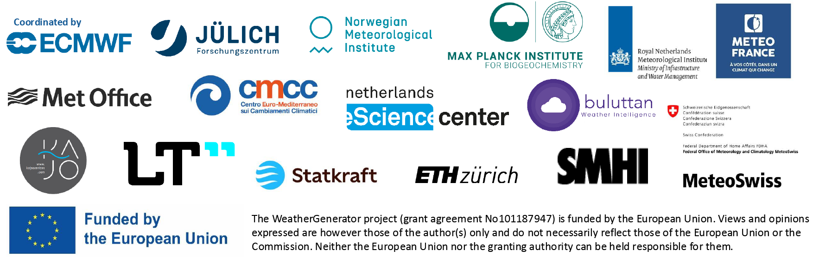

  

  <h1>The WeatherGenerator   Machine Learning Earth System Model</h1>

The WeatherGenerator project is developing a machine learning-based Earth system model. 
It will be trained on a wide range of datasets, including reanalyses, forecast data and observations, to provide a robust and versatile model for the dynamics.
Through this, it can be used for a wide-range of applications. 

More details coming soon. Please open an issue if you are interested in using the model.

  

# How to use the WeatherGenerator project

The model is currently being developed by the WeatherGenerator Consortium. If you want to
engage, you are encouraged to contact us first.

# Development guidelines

The [main branch](https://github.com/ecmwf/WeatherGenerator/tree/main) is the most stable version. If you are running experiments, you should use this branch.

The [develop branch](https://github.com/ecmwf/WeatherGenerator/tree/develop) has the latest
features, but it is generally less stable for the time being. If you want to contribute
to the development of algorithms, you should use this branch.